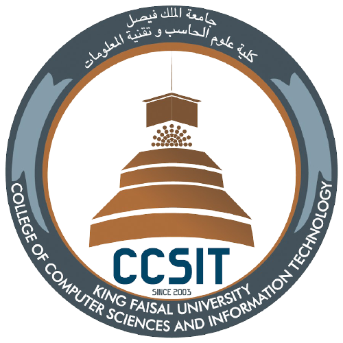

#    Natural language processing Assignment 

This assignment intends to establish understanding of the Natural language processing and the operations that can be used as preprocessing tasks using python NLTK. 
1. Print all the Arabic Stopwords.
2. Print the total number of male and female names in the names corpus. Then, Print the first 15 male and female names.
3. Omit a given list of stop words ('again', 'once' and 'from') from the total stopwords list of English language.
4. Print the definition and examples of any one English language word using WordNet corpus.
5. From the
